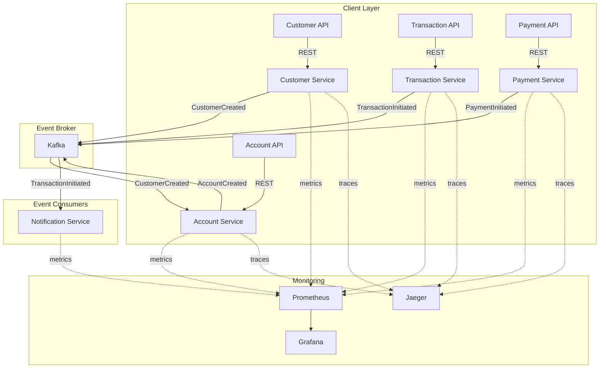

<div align="center">
  <h1>Event-Driven Banking</h1>
  <p><strong>Sistema bancario event-driven con Spring Boot, Kafka, OpenTelemetry y más</strong></p>

  <p>
    
    
    
    
    
    
    <br/>
    
    
    
  </p>
</div>

---

## Tabla de Contenidos

- [Descripción](#descripci%C3%B3n)
- [Arquitectura](#arquitectura)
- [Stack Tecnológico](#stack-tecnol%C3%B3gico)
- [Requisitos](#requisitos)
- [Inicio Rápido](#inicio-r%C3%A1pido)
- [API Endpoints](#api-endpoints)
- [Flujo de Eventos](#flujo-de-eventos)
- [Monitoreo](#monitoreo)
- [Tests](#tests)
- [Estructura del Proyecto](#estructura-del-proyecto)
- [Roadmap](#roadmap)
- [Contribuciones](#contribuciones)
- [Licencia](#licencia)

---

## Descripción

**Event-Driven Banking** es un sistema bancario completo basado en **arquitectura event-driven** con 6 microservicios independientes que se comunican asincrónicamente a través de **Apache Kafka**.

Diseñado como ejemplo didáctico y plantilla para proyectos reales, cubre:

- Creación de clientes bancarios
- Apertura automática de cuentas al crear un cliente
- Transferencias entre cuentas
- Procesamiento de pagos externos
- Notificaciones automáticas
- Trazabilidad distribuida con OpenTelemetry
- Monitoreo con Prometheus + Grafana

---

## Arquitectura



### Flujo de datos

```
 1. POST /api/v1/customers            →  Customer Service     →  Kafka (customer.created)
 2. Kafka (customer.created)          →  Account Service      →  Crea cuenta automáticamente
 3. Account Service                   →  Kafka (account.created)
 4. POST /api/v1/transactions/transfer →  Transaction Service  →  Kafka (transaction.initiated)
 5. Kafka (transaction.initiated)     →  Notification         →  Log de notificación
 6. POST /api/v1/payments             →  Payment Service      →  Kafka (payment.initiated)
 8. Payment Service                   →  Kafka (payment.processed)
```

---

## Stack Tecnológico

| Categoría | Tecnologías |
|-----------|------------|
| **Runtime** | Java 21, Spring Boot 3.3.5, Maven |
| **Event Broker** | Apache Kafka 7.6 + Schema Registry |
| **Databases** | PostgreSQL 16 (1 por servicio) |
| **Observabilidad** | OpenTelemetry, Jaeger, Micrometer |
| **Monitoreo** | Prometheus, Grafana |
| **Contenedores** | Docker, Docker Compose |
| **CI/CD** | GitHub Actions |
| **Tests** | JUnit 5, Testcontainers |

---

## Requisitos

- Docker & Docker Compose
- Java 21+ (solo para desarrollo local)
- Maven 3.9+ (solo para desarrollo local)

---

## Inicio Rápido

```bash
# 1. Clonar
git clone https://github.com/sevillacesar/spring-boot-event-driven-banking.git
cd spring-boot-event-driven-banking

# 2. Iniciar toda la infraestructura + servicios
docker compose up -d

# 3. (Opcional) Monitoreo
docker compose -f docker-compose.monitoring.yml up -d

# 4. Verificar que todo funciona
curl http://localhost:8080/actuator/health
curl http://localhost:8081/actuator/health
curl http://localhost:8082/actuator/health
```

### Probar el flujo completo

```bash
# Crear un cliente
curl -X POST http://localhost:8080/api/v1/customers \
  -H "Content-Type: application/json" \
  -d '{
    "firstName": "Juan",
    "lastName": "Pérez",
    "email": "juan@example.com",
    "documentNumber": "12345678",
    "phone": "+593999999999"
  }'

# Obtener cuentas del cliente
curl http://localhost:8081/api/v1/accounts/customer/{customerId}

# Realizar una transferencia
curl -X POST http://localhost:8082/api/v1/transactions/transfer \
  -H "Content-Type: application/json" \
  -d '{
    "sourceAccountId": "{sourceAccountId}",
    "targetAccountId": "{targetAccountId}",
    "amount": 500.00,
    "currency": "USD",
    "description": "Pago de servicios"
  }'
```

---

## API Endpoints

### Customer Service (:8080)

| Método | Endpoint | Descripción |
|--------|----------|-------------|
| `POST` | `/api/v1/customers` | Crear cliente |
| `GET` | `/api/v1/customers` | Listar clientes |
| `GET` | `/api/v1/customers/{id}` | Obtener cliente |

### Account Service (:8081)

| Método | Endpoint | Descripción |
|--------|----------|-------------|
| `POST` | `/api/v1/accounts` | Crear cuenta (adicional) |
| `GET` | `/api/v1/accounts` | Listar cuentas |
| `GET` | `/api/v1/accounts/{id}` | Obtener cuenta |
| `GET` | `/api/v1/accounts/customer/{customerId}` | Cuentas por cliente |
| `POST` | `/api/v1/accounts/{id}/deposit` | Depositar fondos |

### Transaction Service (:8082)

| Método | Endpoint | Descripción |
|--------|----------|-------------|
| `POST` | `/api/v1/transactions/transfer` | Realizar transferencia |
| `GET` | `/api/v1/transactions/{id}` | Obtener transacción |
| `GET` | `/api/v1/transactions/account/{accountId}` | Transacciones por cuenta |

### Payment Service (:8084)

| Método | Endpoint | Descripción |
|--------|----------|-------------|
| `POST` | `/api/v1/payments` | Iniciar pago |
| `GET` | `/api/v1/payments` | Listar pagos |
| `GET` | `/api/v1/payments/{id}` | Obtener pago |

---

## Monitoreo

| Herramienta | URL | Credenciales |
|-------------|-----|--------------|
| Jaeger (Traces) | http://localhost:16686 | - |
| Prometheus (Metrics) | http://localhost:9090 | - |
| Grafana (Dashboards) | http://localhost:3000 | admin / admin |

---

## Tests

```bash
mvn clean verify
```

Los tests usan **Testcontainers** para levantar PostgreSQL y Kafka reales en contenedores durante las pruebas de integración.

---

## Estructura del Proyecto

```
spring-boot-event-driven-banking/
├── services/
│   ├── customer-service/        # Gestión de clientes
│   ├── account-service/         # Gestión de cuentas
│   ├── transaction-service/     # Procesamiento de transacciones
│   ├── payment-service/         # Procesamiento de pagos
│   └── notification-service/    # Notificaciones
├── shared/                      # Eventos compartidos
├── kafka/
│   ├── topics-config.sh
│   └── schemas/
├── monitoring/
│   ├── prometheus/prometheus.yml
│   └── grafana/dashboards/
├── docker-compose.yml
├── docker-compose.monitoring.yml
├── .github/workflows/
│   └── ci.yml
├── docs/
├── README.md
└── pom.xml
```

---

## Roadmap

- [x] Customer Service (CRUD + eventos)
- [x] Account Service (escucha eventos + CRUD)
- [x] Transaction Service (eventos + CRUD)
- [x] Notification Service (consumidor de eventos)
- [x] Payment Service (procesamiento de pagos)
- [x] Docker Compose completo
- [x] OpenTelemetry tracing
- [x] Prometheus + Grafana
- [ ] Kubernetes manifests
- [ ] Spring Cloud Gateway (API Gateway)
- [ ] Tests con Testcontainers
- [ ] Schema Registry con Avro
- [ ] Autenticación con OAuth2
- [ ] Frontend Angular

---

## Contribuciones

Las contribuciones son bienvenidas. Por favor:

1. Fork el proyecto
2. Creá tu Feature Branch (`git checkout -b feature/AmazingFeature`)
3. Commit tus cambios
4. Push a la Branch (`git push origin feature/AmazingFeature`)
5. Abrí un Pull Request

---

## Licencia

Distribuido bajo MIT License. Ver [LICENSE](LICENSE) para más información.

---

<div align="center">
  <p>Hecho con ❤️ por <a href="https://github.com/sevillacesar">César Sevilla</a></p>
  <p>
    <a href="https://github.com/sevillacesar/spring-boot-event-driven-banking">⭐ Star</a>
    ·
    <a href="https://github.com/sevillacesar/spring-boot-event-driven-banking/issues">🐛 Reportar Bug</a>
    ·
    <a href="https://github.com/sevillacesar/spring-boot-event-driven-banking/issues">💡 Sugerir Feature</a>
  </p>
</div>
